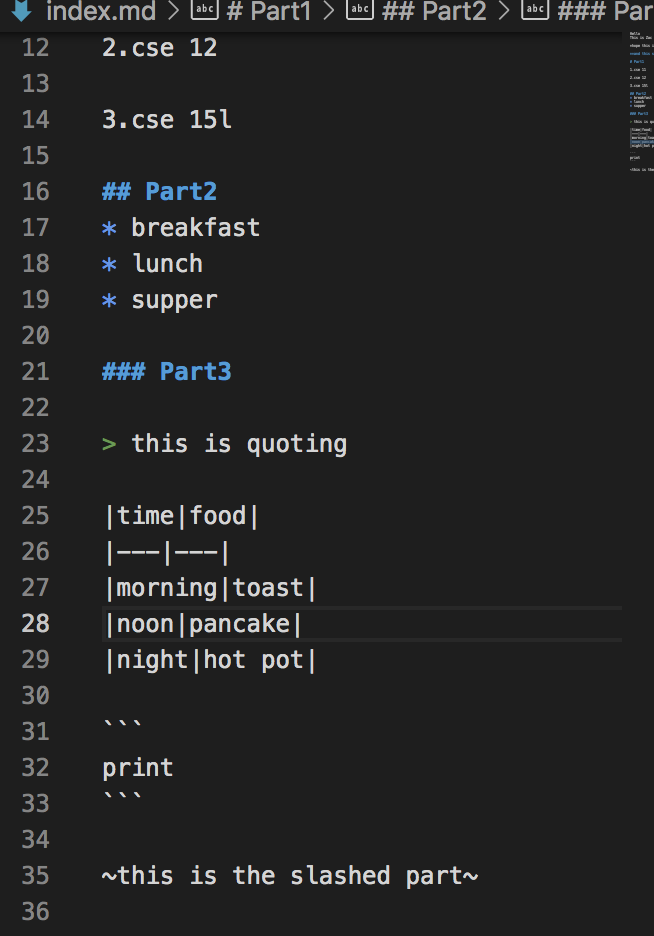

Hello
This is Zac

*hope this is italic*

**and this should be bold**

# Part1

1.cse 11

2.cse 12

3.cse 15l

# Part2
* breakfast
* lunch
* supper

# Part3

> this is quoting

|time|food|
|---|---|
|morning|toast|
|noon|pancake|
|night|hot pot|
||


```java

    system.out.print("what")

```
---
---
~this is the slashed part~


